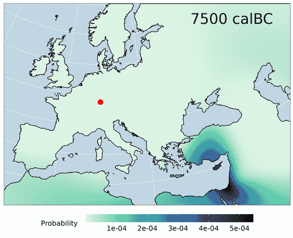

<!-- Rmd -> md -->


[](https://github.com/nevrome/mobest/actions/workflows/check-release.yaml)

# mobest

This R package provides types and functions for spatiotemporal
interpolation of human genetic ancestry components, similarity search
and the calculation of a derived measure for **mob**ility
**est**imation. The workflow in version X.X.X was specifically developed
to support this research compendium:
<https://github.com/nevrome/mobest.analysis.2022>.



0.  `mobest` assumes you have a set of genetic samples with spatial (two
    coordinates in a projected reference system) and temporal positions
    (years BC/AD) for which you calculated a derived, numeric measure of
    genetic ancestry (e.g. coordinates in a PCA or MDS space).
1.  `mobest` provides a framework to perform spatiotemporal
    interpolation using Gaussian process regression (kriging) with the
    [`laGP`](https://CRAN.R-project.org/package=laGP) package to
    reconstruct an ancestry field based on the ancestry measure you
    provided.
2.  `mobest` allows to derive a similarity probability for samples of
    interest within the interpolated field, which – under certain
    circumstances – can be interpreted as an origin probability. See the
    [example gif](man/figures/) on the right.
3.  `mobest` finally introduces functions to estimate and summarize a
    measure of mobility for the samples of interest, based on the
    similarity probability field.

Here is a simple, artificial example how 2. can be used:

``` r
library(magrittr)
set.seed(145)

# a function to calculate the similarity probability for one particular sample
locate_simple <- mobest::locate(
  # spatiotemporal coordinates of the reference samples informing the ancestry field
  independent = mobest::create_spatpos(
    id = 1:100,
    x = c(sample(100000:700000, 50), sample(300000:1000000, 50)), # space x
    y = c(sample(100000:700000, 50), sample(300000:1000000, 50)), # space y
    z = c(sample(-5000:-3500, 50), sample(-4500:-3000, 50))       # time
  ),
  # genetic coordinates of the reference samples
  dependent = mobest::create_obs(
    ac1 = c(runif(50, 0, 0.6), runif(50, 0.4, 1)), # PCA coordinate 1
    ac2 = c(runif(50, 0, 0.3), runif(50, 0.5, 1))  # PCA coordinate 2
  ),
  # field properties for each ancestry component
  kernel = mobest::create_kernset(
    ac1 = mobest::create_kernel(1000000, 1000000, 200, 0.1),
    ac2 = mobest::create_kernel(1000000, 1000000, 200, 0.1)
  ),
  # spatiotemporal coordinates of the sample of interest
  search_independent = mobest::create_spatpos(
    id = 1,
    x = sample(100000:1000000, 1), # space x
    y = sample(100000:1000000, 1), # space y
    z = sample(-5000:-3000, 1)     # time
  ),
  # genetic coordinates of the sample of interest
  search_dependent = mobest::create_obs(
    ac1 = runif(1, 0, 0.6), # PCA coordinate 1
    ac2 = runif(1, 0, 0.5)  # PCA coordinate 2
  ),
  # spatial search grid: Where to search
  search_space_grid = expand.grid(
      x = seq(100000, 1000000, 100000), 
      y = seq(100000, 1000000, 100000)
    ) %>% { mobest::create_geopos(id = 1:nrow(.), x = .$x, y = .$y) },
  # search time: When to search
  search_time = -500,
  quiet = T
)

# multiply probabilities for PCA coordinate 1 and PCA coordinate 2
locate_product <- mobest::multiply_dependent_probabilities(locate_simple)

# plot the resulting probability surface
library(ggplot2)
locate_product %>% ggplot() +
  geom_raster(mapping = aes(x = field_x, y = field_y, fill = probability)) +
  geom_point(mapping = aes(x = search_x, y = search_y), colour = "red") +
  coord_fixed() +
  ggtitle(paste0(
    "t for sample of interest = ", unique(locate_product$search_z), "\n",
    "t field time slice = ", unique(locate_product$field_z)
  ))
```

<!-- -->

## Installation

Install the package from github with the following command in R:

    if(!require('remotes')) install.packages('remotes')
    remotes::install_github('nevrome/mobest')

## Overview

The following guide briefly lists the data types and functions of
`mobest` loosely in the order one would usually call them and thus
introduces the interface and workflow.

### Basic data types

`mobest` employs a number of basic [S3 data
types](http://adv-r.had.co.nz/S3.html) to formalize the input to almost
all of its functions. The constructors check certain properties to
insure input correctness.

#### Spatial coordinates

`mobest::create_geopos` creates an object of class
`mobest_spatialpositions` which is a `tibble` that represents spatial
positions. Spatial positions in `mobest` are always 2-dimensional
coordinates in a Cartesian space. For real world coordinates that means,
that they have to be transformed to a projected coordinate system
(e.g. with `sf::st_transform`): `mobest` can not be used with longitude
and latitude coordinates.

``` r
mobest::create_geopos(
  id = 1:100,
  x = c(sample(100000:700000, 50), sample(300000:1000000, 50)),
  y = c(sample(100000:700000, 50), sample(300000:1000000, 50))
)
```

    ## # A tibble: 100 × 3
    ##       id      x      y
    ##    <int>  <int>  <int>
    ##  1     1 349697 531615
    ##  2     2 682396 677009
    ##  3     3 111943 674572
    ##  4     4 539214 440676
    ##  5     5 255543 244130
    ##  6     6 678504 341140
    ##  7     7 536256 545510
    ##  8     8 544375 530917
    ##  9     9 208521 371833
    ## 10    10 115593 134532
    ## # … with 90 more rows

For the interpolation fields we often want regular, spatial grids
covering a specific spatial area. These can be constructed with
`mobest::create_prediction_grid`, which takes an object of class `sf`
with polygons in a projected coordinate system. It also yields an object
of class `mobest_spatialpositions`.

Here is an example for the landmass of Europe, covered in a 250km grid:

``` r
rnaturalearthdata::countries50 %>%
  sf::st_as_sf() %>%
  sf::st_make_valid() %>%
  sf::st_crop(xmin = -10.8, ymin = 33.6, xmax = 34.5, ymax = 61.3) %>%
  sf::st_transform(3857) %>%
  mobest::create_prediction_grid(250000) %>%
  ggplot() +
    geom_raster(aes(x, y)) +
    geom_text(aes(x,y,label = id), colour = "white", size = 2.5) +
    coord_fixed()
```

<!-- -->

#### Spatiotemporal coordinates

`mobest_spatialpositions` can be transformed to
`mobest_spatiotemporalpositions` with `mobest::geopos_to_spatpos`. This
function calculates the permutations of all spatial positions with a
new, implicitly temporal dimension `z`. `mobest_spatiotemporalpositions`
is also derived from `tibble`.

``` r
mobest::geopos_to_spatpos(
  mobest::create_geopos(
    id = 1:100,
    x = c(sample(100000:700000, 50), sample(300000:1000000, 50)),
    y = c(sample(100000:700000, 50), sample(300000:1000000, 50))
  ),
  c(-5000, -4900, -4800)
)
```

    ## # A tibble: 300 × 5
    ##       id      x      y     z geo_id
    ##    <int>  <int>  <int> <dbl>  <int>
    ##  1     1 329750 162954 -5000      1
    ##  2     2 329750 162954 -4900      1
    ##  3     3 329750 162954 -4800      1
    ##  4     4 334821 301093 -5000      2
    ##  5     5 334821 301093 -4900      2
    ##  6     6 334821 301093 -4800      2
    ##  7     7 460308 458861 -5000      3
    ##  8     8 460308 458861 -4900      3
    ##  9     9 460308 458861 -4800      3
    ## 10    10 697811 669567 -5000      4
    ## # … with 290 more rows

`mobest::create_spatpos` directly creates
`mobest_spatiotemporalpositions` objects to represent spatiotemporal
positions.

``` r
positions <- mobest::create_spatpos(
  id = 1:100,
  x = c(sample(100000:700000, 50), sample(300000:1000000, 50)),
  y = c(sample(100000:700000, 50), sample(300000:1000000, 50)),
  z = c(sample(-5000:-3500, 50), sample(-4500:-3000, 50))
)
```

    ## # A tibble: 100 × 4
    ##       id      x      y     z
    ##    <int>  <int>  <int> <int>
    ##  1     1 593039 372080 -3586
    ##  2     2 326494 513740 -4501
    ##  3     3 636281 563535 -4272
    ##  4     4 122139 171731 -3975
    ##  5     5 540838 345322 -4791
    ##  6     6 298406 213714 -3961
    ##  7     7 364614 301969 -3868
    ##  8     8 301387 108758 -4638
    ##  9     9 476376 567265 -4779
    ## 10    10 511404 537129 -4283
    ## # … with 90 more rows

#### Genetic coordinates

`mobest::create_obs` creates an object `mobest_observations`, which is a
`tibble` with genetic coordinates. Genetic coordinates can be any simple
numeric measure of ancestry, for example the position of the samples in
PCA space.

``` r
observations <- mobest::create_obs(
  ac1 = c(runif(50, 0, 0.6), runif(50, 0.4, 1)), # "ac" here for "ancestry component", e.g. PCA coordinate 1
  ac2 = c(runif(50, 0, 0.3), runif(50, 0.5, 1)) # e.g. PCA coordinate 2
)
```

    ## # A tibble: 100 × 2
    ##       ac1    ac2
    ##     <dbl>  <dbl>
    ##  1 0.370  0.208 
    ##  2 0.331  0.151 
    ##  3 0.455  0.183 
    ##  4 0.114  0.194 
    ##  5 0.563  0.240 
    ##  6 0.0873 0.0353
    ##  7 0.203  0.0386
    ##  8 0.538  0.272 
    ##  9 0.316  0.0307
    ## 10 0.578  0.0695
    ## # … with 90 more rows

Names and number of the components are freely selectable, so instead of
`ac1` + `ac2` as in the example here, one could, for example, also have
`PC1` + `PC2` + `PC3`, or `MDS1` + `MDS2`.

#### Kernel parameter settings

Gaussian process regression requires a parametrized covariance function:
a “kernel”. One `mobest_kernel` can be constructed with
`mobest::create_kernel`. `mobest_kernel` only represents one specific
kernel, though, for one specific ancestry component (e.g. `ac1`). Given
that an analysis typically involves multiple genetic coordinates
`mobest::create_kernset` provides a wrapper to bundle multiple kernels
directly in an object of class `mobest_kernelsetting`.

``` r
kernset <- mobest::create_kernset(
  ac1 = mobest::create_kernel(1000000, 1000000, 200, 0.1),
  ac2 = mobest::create_kernel(1000000, 1000000, 200, 0.1)
)
```

If a function requires both input of type `mobest_observations` and
`mobest_kernelsetting`, then the names of the individual ancestry
components must be identical, i.e. fit to each other.

#### Variability and permutations

When working with real data we often need to explore permutations of
data or account for uncertainty by sampling from distributions
(e.g. uncertain dating). To represent that, `mobest` provides wrapper
classes and constructors with a `*_multi` suffix, to bundle multiple
individual elements in a list class. Some of the core functions provide
interfaces that automatically consider all permutations of these input
lists.

Available are:

- `mobest_spatialpositions_multi` (`mobest::create_geopos_multi`)
- `mobest_spatiotemporalpositions_multi`
  (`mobest::create_spatpos_multi`)
- `mobest_observations_multi` (`mobest::create_obs_multi`)
- `mobest_kernelsetting_multi` (`mobest::create_kernset_multi`)

And here is an example how they can be filled with named arguments:

``` r
multiple_kernel_settings <- mobest::create_kernset_multi(
  kernel_1 = mobest::create_kernset(
    ac1 = mobest::create_kernel(1000000, 1000000, 200, 0.1),
    ac2 = mobest::create_kernel(1000000, 1000000, 200, 0.1)
  ),
  kernel_2 = mobest::create_kernset(
    ac1 = mobest::create_kernel(1000000, 1000000, 200, 0.1),
    ac2 = mobest::create_kernel(1000000, 1000000, 250, 0.1)
  )
)
```

### Parameter estimation

One important question for the Gaussian process regression performed
within multiple of the core functions of `mobest` is a correct and
useful setting for the kernel parameters. The package therefore provides
different helper functions to either estimate them or prepare data
products that can be used to estimate them.

#### Variogram calculation

`mobest::calculate_pairwise_distances` calculates different types of
pairwise distances (spatial, temporal, ancestry components) for each
input sample pair and returns them in a long format `tibble` of class
`mobest_pairwisedistances`.

``` r
pairwise_distances <- mobest::calculate_pairwise_distances(
  independent = positions,
  dependent = observations,
  m_to_km = T
)
```

    ## # A tibble: 10,000 × 9
    ##      id1   id2 geo_dist time_dist obs_dist_total ac1_d…¹ ac1_d…² ac2_d…³ ac2_d…⁴
    ##    <int> <int>    <dbl>     <dbl>          <dbl>   <dbl>   <dbl>   <dbl>   <dbl>
    ##  1     1     1      0           0         0       0      0        0      0      
    ##  2     2     1    302.        915         0.0697  0.0391 0.0776   0.0577 0.183  
    ##  3     3     1    196.        686         0.0881  0.0845 0.0631   0.0249 0.00299
    ##  4     4     1    512.        389         0.256   0.256  0.00965  0.0145 0.385  
    ##  5     5     1     58.7      1205         0.195   0.193  0.343    0.0313 0.304  
    ##  6     6     1    334.        375         0.332   0.283  0.0898   0.173  0.119  
    ##  7     7     1    239.        282         0.238   0.167  0.0402   0.170  0.0297 
    ##  8     8     1    393.       1052         0.180   0.168  0.473    0.0639 0.536  
    ##  9     9     1    227.       1193         0.186   0.0546 0.0230   0.178  0.0192 
    ## 10    10     1    184.        697         0.250   0.208  0.236    0.139  0.0415 
    ## # … with 9,990 more rows, and abbreviated variable names ¹​ac1_dist,
    ## #   ²​ac1_dist_resid, ³​ac2_dist, ⁴​ac2_dist_resid

Helper functions are available to calculate the individual components of
this table:

``` r
geo_dist <- mobest::calculate_geo_pairwise_distances(positions)
time_dist <- mobest::calculate_time_pairwise_distances(positions)
obs_dist <- mobest::calculate_dependent_pairwise_distances(positions$id, observations)
```

`mobest::bin_pairwise_distances` bins the pairwise distances in an
`mobest_pairwisedistances` object and calculates an empirical variogram
(class `mobest_empiricalvariogram`) from them.

``` r
variogram <- mobest::bin_pairwise_distances(
  pairwise_distances,
  geo_bin = 100, time_bin = 100
)
```

    ## # A tibble: 198 × 8
    ##    geo_dist_cut time_dist_cut obs_dist_t…¹ ac1_d…² ac1_d…³ ac2_d…⁴ ac2_d…⁵     n
    ##           <dbl>         <dbl>        <dbl>   <dbl>   <dbl>   <dbl>   <dbl> <int>
    ##  1           50            50       0.0314  0.0195  0.0193  0.0119  0.0115   152
    ##  2           50           150       0.0722  0.0282  0.0260  0.0440  0.0478    58
    ##  3           50           250       0.0887  0.0312  0.0320  0.0575  0.0522    38
    ##  4           50           350       0.0937  0.0438  0.0476  0.0499  0.0523    36
    ##  5           50           450       0.0939  0.0336  0.0331  0.0602  0.0529    44
    ##  6           50           550       0.0974  0.0461  0.0428  0.0514  0.0401    42
    ##  7           50           650       0.0907  0.0482  0.0533  0.0425  0.0566    12
    ##  8           50           750       0.0802  0.0320  0.0351  0.0482  0.0470    30
    ##  9           50           850       0.112   0.0265  0.0302  0.0856  0.0719    28
    ## 10           50           950       0.0916  0.0367  0.0360  0.0550  0.0445    18
    ## # … with 188 more rows, and abbreviated variable names ¹​obs_dist_total,
    ## #   ²​ac1_dist, ³​ac1_dist_resid, ⁴​ac2_dist, ⁵​ac2_dist_resid

This variogram can for example be used to estimate the nugget parameter
of the GPR kernel settings, by filtering for pairwise “genetic”
distances with very small spatial and temporal distances.

#### Maximum likelihood estimation

`mobest::laGP_mle_anisotropic` wraps around `laGP::mleGPsep` to perform
marginal maximum likelihood inference for anisotropic (separable)
Gaussian lengthscale and nugget parameters.

``` r
mleGPsep_out <- mobest::laGP_mle_anisotropic(
  independent = dplyr::mutate(positions, x = x/1000, y = y/1000),
  dependent = observations,
  iterations = 2,
  verb = 0
)
```

    ## # A tibble: 4 × 9
    ##   mle_method dependent_var_id   dsx   dsy    dt      g optimiz…¹ message conve…²
    ##   <chr>      <chr>            <dbl> <dbl> <dbl>  <dbl>     <int> <chr>     <int>
    ## 1 mleGPsep   ac1              1318. 1378. 1353. 0.0627        50 CONVER…       0
    ## 2 mleGPsep   ac1              1318. 1378. 1353. 0.0627        50 CONVER…       0
    ## 3 mleGPsep   ac2              1182. 1276. 1431. 0.0903        34 CONVER…       0
    ## 4 mleGPsep   ac2              1182. 1276. 1431. 0.0903        34 CONVER…       0
    ## # … with abbreviated variable names ¹​optimizer_iterations, ²​converged

`mobest::laGP_jmle_anisotropic` does the same, but for joint maximum
likelihood inference.

``` r
jmleGPsep_out <- mobest::laGP_jmle_anisotropic(
  independent = dplyr::mutate(positions, x = x/1000, y = y/1000),
  dependent = observations,
  iterations = 2,
  verb = 0
)
```

    ## # A tibble: 4 × 9
    ##   mle_method dependent_var_id   dsx   dsy    dt      g optimiz…¹ message conve…²
    ##   <chr>      <chr>            <dbl> <dbl> <dbl>  <dbl>     <int> <chr>     <int>
    ## 1 jmleGPsep  ac1              1318. 1378. 1353. 0.0627        82 <NA>          0
    ## 2 jmleGPsep  ac1              1318. 1378. 1353. 0.0627        82 <NA>          0
    ## 3 jmleGPsep  ac2              1182. 1276. 1431. 0.0903        61 <NA>          0
    ## 4 jmleGPsep  ac2              1182. 1276. 1431. 0.0903        61 <NA>          0
    ## # … with abbreviated variable names ¹​optimizer_iterations, ²​converged

`mobest::laGP_mle_sequence_isotropic_fixed_g` implements a very specific
approach, where the mle is performed under the assumption of an
isotropic system, but with a series of scaling factors to explore the
space-time-relation. The nugget term g is fixed.

``` r
mle_sequence <- mobest::laGP_mle_sequence_isotropic_fixed_g(
  independent = dplyr::mutate(positions, x = x/1000, y = y/1000),
  dependent = observations,
  iterations = 2,
  g = c(ac1 = 0.1, ac2 = 0.1),
  space_time_scaling_factor_sequence = seq(0.1, 2, 0.1),
  verb = 0
)
```

    ## # A tibble: 80 × 10
    ##    iteration dependent…¹ scali…² scali…³ scali…⁴     d     l optim…⁵    ds    dt
    ##        <int> <chr>         <dbl> <fract> <fct>   <dbl> <dbl>   <int> <dbl> <dbl>
    ##  1         1 ac1             0.1 0.1     1/10     883. -52.1      11  883. 8831.
    ##  2         1 ac1             0.2 0.2     1/5      960. -52.8      11  960. 4802.
    ##  3         1 ac1             0.3 0.3     3/10    1041. -53.3      11 1041. 3471.
    ##  4         1 ac1             0.4 0.4     2/5     1123. -53.6      10 1123. 2809.
    ##  5         1 ac1             0.5 0.5     1/2     1196. -53.8      10 1196. 2392.
    ##  6         1 ac1             0.6 0.6     3/5     1255. -53.8      10 1255. 2092.
    ##  7         1 ac1             0.7 0.7     7/10    1307. -53.8      11 1307. 1867.
    ##  8         1 ac1             0.8 0.8     4/5     1365. -53.7      11 1365. 1707.
    ##  9         1 ac1             0.9 0.9     9/10    1436. -53.7      11 1436. 1596.
    ## 10         1 ac1             1   1.0     1       1520. -53.6      11 1520. 1520.
    ## # … with 70 more rows, and abbreviated variable names ¹​dependent_var_id,
    ## #   ²​scaling_factor, ³​scaling_factor_fractional, ⁴​scaling_factor_label,
    ## #   ⁵​optimizer_iterations

#### Crossvalidation

`mobest::crossvalidate` allows to tackle the parameter estimation
challenge with simple crossvalidation across a grid of kernel function
parameters. Internally it employs `mobest::create_model_grid` and
`mobest::run_model_grid` (see below). Crossvalidation is computationally
expensive, but in our experience the best method for the kernel
parameter estimation.

``` r
kernels_to_test <- expand.grid(
  ds = seq(100,200, 50)*1000,
  dt = seq(100,200, 50)
) %>% purrr::pmap(function(...) {
    row <- list(...)
    mobest::create_kernset(
      ac1 = mobest::create_kernel(row$ds, row$ds, row$dt, 0.065),
      ac2 = mobest::create_kernel(row$ds, row$ds, row$dt, 0.08)
    )
  }) %>%
  magrittr::set_names(paste("kernel", 1:length(.), sep = "_")) %>%
  do.call(mobest::create_kernset_multi, .)

interpol_comparison <- mobest::crossvalidate(
  independent = positions,
  dependent = observations,
  kernel = kernels_to_test,
  iterations = 2,
  groups = 10,
  quiet = T
)
```

    ## # A tibble: 3,600 × 18
    ##    indep…¹ depen…² depen…³ kerne…⁴ pred_…⁵ mixin…⁶   dsx   dsy    dt     g    id
    ##    <chr>   <chr>   <chr>   <chr>   <chr>     <int> <dbl> <dbl> <dbl> <dbl> <int>
    ##  1 ind_cr… obs_cr… ac1     kernel… pred_c…       1   1e5   1e5   100 0.065    45
    ##  2 ind_cr… obs_cr… ac1     kernel… pred_c…       1   1e5   1e5   100 0.065    16
    ##  3 ind_cr… obs_cr… ac1     kernel… pred_c…       1   1e5   1e5   100 0.065    43
    ##  4 ind_cr… obs_cr… ac1     kernel… pred_c…       1   1e5   1e5   100 0.065    96
    ##  5 ind_cr… obs_cr… ac1     kernel… pred_c…       1   1e5   1e5   100 0.065    61
    ##  6 ind_cr… obs_cr… ac1     kernel… pred_c…       1   1e5   1e5   100 0.065    93
    ##  7 ind_cr… obs_cr… ac1     kernel… pred_c…       1   1e5   1e5   100 0.065    24
    ##  8 ind_cr… obs_cr… ac1     kernel… pred_c…       1   1e5   1e5   100 0.065    21
    ##  9 ind_cr… obs_cr… ac1     kernel… pred_c…       1   1e5   1e5   100 0.065    42
    ## 10 ind_cr… obs_cr… ac1     kernel… pred_c…       1   1e5   1e5   100 0.065    15
    ## # … with 3,590 more rows, 7 more variables: x <int>, y <int>, z <int>,
    ## #   mean <dbl>, sd <dbl>, measured <dbl>, difference <dbl>, and abbreviated
    ## #   variable names ¹​independent_table_id, ²​dependent_setting_id,
    ## #   ³​dependent_var_id, ⁴​kernel_setting_id, ⁵​pred_grid_id, ⁶​mixing_iteration

### Spatiotemporal interpolation

The spatiotemporal interpolation workflow consists of the creation of a
list of models and then subsequently running each element in this list
to construct different ancestry fields. The actual interpolation is done
in a function `mobest:::interpolate`, which has a minimal interface and
is therefore kept internal.

`mobest::create_model_grid` creates an object of class
`mobest_modelgrid` which holds all permutations of the field-defining
input objects. Each row equals one complete model definition with all
parameters and input data fully defined.

``` r
library(magrittr)
model_grid <- mobest::create_model_grid(
  independent = mobest::create_spatpos_multi(
    dating_1 = positions %>% dplyr::mutate(z = z + sample(-100:100, 100)),
    dating_2 = positions %>% dplyr::mutate(z = z + sample(-100:100, 100))
  ),
  dependent = mobest::create_obs_multi(
    obs1 = observations,
    obs2 = observations
  ),
  kernel = mobest::create_kernset_multi(
    kernel_1 = mobest::create_kernset(
      ac1 = mobest::create_kernel(1000000, 1000000, 200, 0.1),
      ac2 = mobest::create_kernel(1000000, 1000000, 200, 0.1)
    ),
    kernel_2 = mobest::create_kernset(
      ac1 = mobest::create_kernel(1000000, 1000000, 200, 0.1),
      ac2 = mobest::create_kernel(1000000, 1000000, 250, 0.1)
    )
  ),
  prediction_grid = mobest::create_spatpos_multi(
    pred_grid_1 = expand.grid(
      x = seq(100000, 1000000, 100000), 
      y = seq(100000, 1000000, 100000),
      z = seq(-5500, -3000, 500)
    ) %>% { mobest::create_spatpos(id = 1:nrow(.), x = .$x, y = .$y, z = .$z) },
    pred_grid_2 = expand.grid(
      x = seq(100000, 1000000, 100000), 
      y = seq(100000, 1000000, 100000),
      z = seq(-5500, -3000, 500)
    ) %>% { mobest::create_spatpos(id = 1:nrow(.), x = .$x, y = .$y, z = .$z) }
  )
)
```

    ## # A tibble: 32 × 9
    ##    independent_t…¹ depen…² depen…³ kerne…⁴ pred_…⁵ independ…⁶ depen…⁷ kernel_s…⁸
    ##    <chr>           <chr>   <chr>   <chr>   <chr>   <mbst_sp_> <named> <mbst_krn>
    ##  1 dating_1        obs1    ac1     kernel… pred_g… <mbst_spt> <dbl>   <mbst_krn>
    ##  2 dating_2        obs1    ac1     kernel… pred_g… <mbst_spt> <dbl>   <mbst_krn>
    ##  3 dating_1        obs2    ac1     kernel… pred_g… <mbst_spt> <dbl>   <mbst_krn>
    ##  4 dating_2        obs2    ac1     kernel… pred_g… <mbst_spt> <dbl>   <mbst_krn>
    ##  5 dating_1        obs1    ac2     kernel… pred_g… <mbst_spt> <dbl>   <mbst_krn>
    ##  6 dating_2        obs1    ac2     kernel… pred_g… <mbst_spt> <dbl>   <mbst_krn>
    ##  7 dating_1        obs2    ac2     kernel… pred_g… <mbst_spt> <dbl>   <mbst_krn>
    ##  8 dating_2        obs2    ac2     kernel… pred_g… <mbst_spt> <dbl>   <mbst_krn>
    ##  9 dating_1        obs1    ac1     kernel… pred_g… <mbst_spt> <dbl>   <mbst_krn>
    ## 10 dating_2        obs1    ac1     kernel… pred_g… <mbst_spt> <dbl>   <mbst_krn>
    ## # … with 22 more rows, 1 more variable: pred_grid <mbst_sp_>, and abbreviated
    ## #   variable names ¹​independent_table_id, ²​dependent_setting_id,
    ## #   ³​dependent_var_id, ⁴​kernel_setting_id, ⁵​pred_grid_id, ⁶​independent_table,
    ## #   ⁷​dependent_var, ⁸​kernel_setting

`mobest::run_model_grid` runs each model and returns an unnested table
of interpolation results for each prediction grid point and each model
parameter setting.

``` r
interpol_grid <- mobest::run_model_grid(model_grid, quiet = T)
```

    ## # A tibble: 19,200 × 15
    ##    indepen…¹ depen…² depen…³ kerne…⁴ pred_…⁵   dsx   dsy    dt     g    id     x
    ##    <chr>     <chr>   <chr>   <chr>   <chr>   <dbl> <dbl> <dbl> <dbl> <int> <dbl>
    ##  1 dating_1  obs1    ac1     kernel… pred_g…   1e6   1e6   200   0.1     1   1e5
    ##  2 dating_1  obs1    ac1     kernel… pred_g…   1e6   1e6   200   0.1     2   2e5
    ##  3 dating_1  obs1    ac1     kernel… pred_g…   1e6   1e6   200   0.1     3   3e5
    ##  4 dating_1  obs1    ac1     kernel… pred_g…   1e6   1e6   200   0.1     4   4e5
    ##  5 dating_1  obs1    ac1     kernel… pred_g…   1e6   1e6   200   0.1     5   5e5
    ##  6 dating_1  obs1    ac1     kernel… pred_g…   1e6   1e6   200   0.1     6   6e5
    ##  7 dating_1  obs1    ac1     kernel… pred_g…   1e6   1e6   200   0.1     7   7e5
    ##  8 dating_1  obs1    ac1     kernel… pred_g…   1e6   1e6   200   0.1     8   8e5
    ##  9 dating_1  obs1    ac1     kernel… pred_g…   1e6   1e6   200   0.1     9   9e5
    ## 10 dating_1  obs1    ac1     kernel… pred_g…   1e6   1e6   200   0.1    10   1e6
    ## # … with 19,190 more rows, 4 more variables: y <dbl>, z <dbl>, mean <dbl>,
    ## #   sd <dbl>, and abbreviated variable names ¹​independent_table_id,
    ## #   ²​dependent_setting_id, ³​dependent_var_id, ⁴​kernel_setting_id, ⁵​pred_grid_id

### Origin search

`mobest::locate` uses the spatiotemporal interpolation to calculate a
similarity probability between a set of “search” samples and an
interpolation field. It requires the necessary reference sample input to
perform the interpolation, which internally employs
`mobest::create_model_grid` and `mobest::run_model_grid`. The search
then yields a similarity probability value for each grid cell and for
each search sample in an object of class `mobest_locateoverview`. These
probabilities are normalized for each search sample and grid (with the
default `normalize = TRUE`).

``` r
locate_simple <- mobest::locate(
  independent = positions,
  dependent = observations,
  kernel = kernset,
  search_independent = positions[1:4,],
  search_dependent = observations[1:4,],
  search_space_grid = expand.grid(
      x = seq(100000, 1000000, 100000), 
      y = seq(100000, 1000000, 100000)
    ) %>% { mobest::create_geopos(id = 1:nrow(.), x = .$x, y = .$y) },
  search_time = c(0,-100),
  quiet = T
)
```

The spatiotemporal probability grids `locate` returns are calculated are
per ancestry component (as put in via `dependent`/`search_dependent`).
To multiply the ancestry component grids, `mobest` provides
`mobest::multiply_dependent_probabilities`, which yields an object of
class `mobest_locateproduct`. The output probabilities are normalized
per permutation.

``` r
mobest::multiply_dependent_probabilities(locate_simple)
```

    ## # A tibble: 800 × 15
    ##    independent…¹ depen…² kerne…³ pred_…⁴ field…⁵ field_x field_y field_z field…⁶
    ##    <chr>         <chr>   <chr>   <chr>     <int>   <dbl>   <dbl>   <dbl>   <int>
    ##  1 i             d       k       time_s…       1  100000  100000   -3686       1
    ##  2 i             d       k       time_s…       2  200000  100000   -3686       2
    ##  3 i             d       k       time_s…       3  300000  100000   -3686       3
    ##  4 i             d       k       time_s…       4  400000  100000   -3686       4
    ##  5 i             d       k       time_s…       5  500000  100000   -3686       5
    ##  6 i             d       k       time_s…       6  600000  100000   -3686       6
    ##  7 i             d       k       time_s…       7  700000  100000   -3686       7
    ##  8 i             d       k       time_s…       8  800000  100000   -3686       8
    ##  9 i             d       k       time_s…       9  900000  100000   -3686       9
    ## 10 i             d       k       time_s…      10 1000000  100000   -3686      10
    ## # … with 790 more rows, 6 more variables: search_id <int>, search_x <int>,
    ## #   search_y <int>, search_z <int>, search_time <dbl>, probability <dbl>, and
    ## #   abbreviated variable names ¹​independent_table_id, ²​dependent_setting_id,
    ## #   ³​kernel_setting_id, ⁴​pred_grid_id, ⁵​field_id, ⁶​field_geo_id

`mobest::locate` is actually just a special, simplified interface to
`mobest::locate_multi`, which adds another level of complexity. It
allows multiple input values for `independent`, `dependent`, `kernel`,
`search_independent` and `search_dependent` and the result will
therefore consider all permutations of these input settings
(`independent` and `search_independent` as well as `dependent` and
`search_dependent` have to be congruent, though).

``` r
locate_overview <- mobest::locate_multi(
  independent = mobest::create_spatpos_multi(
    dating1 = positions %>% dplyr::mutate(z = z + sample(-100:100, 100)),
    dating2 = positions %>% dplyr::mutate(z = z + sample(-100:100, 100))
  ),
  dependent = mobest::create_obs_multi(
    obs1 = observations, obs2 = observations
  ),
  kernel = mobest::create_kernset_multi(
    kernel_1 = mobest::create_kernset(
      ac1 = mobest::create_kernel(1000000, 1000000, 200, 0.1),
      ac2 = mobest::create_kernel(1000000, 1000000, 200, 0.1)
    ),
    kernel_2 = mobest::create_kernset(
      ac1 = mobest::create_kernel(1000000, 1000000, 200, 0.1),
      ac2 = mobest::create_kernel(1000000, 1000000, 250, 0.1)
    )
  ),
  search_independent = mobest::create_spatpos_multi(
    dating1 = positions[1:4,], dating2 = positions[1:4,]
  ),
  search_dependent = mobest::create_obs_multi(
    obs1 = observations[1:4,], obs2 = observations[1:4,]
  ),
  search_space_grid = expand.grid(
      x = seq(100000, 1000000, 100000), 
      y = seq(100000, 1000000, 100000)
    ) %>% { mobest::create_geopos(id = 1:nrow(.), x = .$x, y = .$y) },
  search_time = 0,
  search_time_mode = "relative",
  quiet = T
)

locate_product <- mobest::multiply_dependent_probabilities(locate_overview)
```

`mobest::locate_multi` produces many probability grids for each sample.
Even after `mobest::multiply_dependent_probabilities` merges the
per-ancestry component iterations, that still leaves many parameter
permutations. `mobest::fold_probabilities_per_group` is a convenient
function to combine these to a single, merged probability grid of class
`mobest_locatefold`. The folding operation can be set in the argument
`folding_operation`, where the default is a simple sum. Again, in the
default setting, the output probabilities are normalized per
permutation.

``` r
mobest::fold_probabilities_per_group(locate_product)
```

    ## # A tibble: 400 × 9
    ##    search_id field_id search_z search_x search_y field_x field_y field_z proba…¹
    ##        <int>    <int>    <int>    <int>    <int>   <dbl>   <dbl>   <dbl>   <dbl>
    ##  1         1        1    -3586   593039   372080  100000  100000   -3586  0.0124
    ##  2         1        2    -3586   593039   372080  200000  100000   -3586  0.0136
    ##  3         1        3    -3586   593039   372080  300000  100000   -3586  0.0149
    ##  4         1        4    -3586   593039   372080  400000  100000   -3586  0.0166
    ##  5         1        5    -3586   593039   372080  500000  100000   -3586  0.0186
    ##  6         1        6    -3586   593039   372080  600000  100000   -3586  0.0203
    ##  7         1        7    -3586   593039   372080  700000  100000   -3586  0.0208
    ##  8         1        8    -3586   593039   372080  800000  100000   -3586  0.0190
    ##  9         1        9    -3586   593039   372080  900000  100000   -3586  0.0155
    ## 10         1       10    -3586   593039   372080 1000000  100000   -3586  0.0115
    ## # … with 390 more rows, and abbreviated variable name ¹​probability

`fold_probabilities_per_group` also allows to maintain the the
permutation groups, in case a full summary is not desired:

``` r
mobest::fold_probabilities_per_group(locate_product, dependent_setting_id, kernel_setting_id)
```

    ## # A tibble: 1,600 × 11
    ##    dependent_s…¹ kerne…² searc…³ field…⁴ searc…⁵ searc…⁶ searc…⁷ field_x field_y
    ##    <chr>         <chr>     <int>   <int>   <int>   <int>   <int>   <dbl>   <dbl>
    ##  1 obs1          kernel…       1       1   -3586  593039  372080  100000  100000
    ##  2 obs1          kernel…       1       2   -3586  593039  372080  200000  100000
    ##  3 obs1          kernel…       1       3   -3586  593039  372080  300000  100000
    ##  4 obs1          kernel…       1       4   -3586  593039  372080  400000  100000
    ##  5 obs1          kernel…       1       5   -3586  593039  372080  500000  100000
    ##  6 obs1          kernel…       1       6   -3586  593039  372080  600000  100000
    ##  7 obs1          kernel…       1       7   -3586  593039  372080  700000  100000
    ##  8 obs1          kernel…       1       8   -3586  593039  372080  800000  100000
    ##  9 obs1          kernel…       1       9   -3586  593039  372080  900000  100000
    ## 10 obs1          kernel…       1      10   -3586  593039  372080 1000000  100000
    ## # … with 1,590 more rows, 2 more variables: field_z <dbl>, probability <dbl>,
    ## #   and abbreviated variable names ¹​dependent_setting_id, ²​kernel_setting_id,
    ## #   ³​search_id, ⁴​field_id, ⁵​search_z, ⁶​search_x, ⁷​search_y

### Origin vectors

To derive a simple, sample-wise measure of mobility,
`mobest::determine_origin_vectors` constructs what we call “origin
vectors” from objects of class `mobest_locateproduct`. Each vector
connects the spatial point where a sample was found (so for ancient
samples that is usually where the respective individual was buried) with
the point of **highest genetic similarity** in the interpolated search
field and its permutations. The output is of class
`mobest_originvectors` and documents distance and direction of the
“origin vector”. Under certain circumstances this vector can serve as a
proxy for mobility.

``` r
mobest::determine_origin_vectors(locate_product, quiet = T)
```

    ## # A tibble: 4 × 21
    ##   independent_…¹ depen…² kerne…³ pred_…⁴ field…⁵ field_x field_y field_z field…⁶
    ##   <chr>          <chr>   <chr>   <chr>     <int>   <dbl>   <dbl>   <dbl>   <int>
    ## 1 dating1        obs1    kernel… time_s…      16  600000  200000   -3586      16
    ## 2 dating1        obs1    kernel… time_s…      43  300000  500000   -4501      43
    ## 3 dating1        obs1    kernel… time_s…      44  400000  500000   -4272      44
    ## 4 dating2        obs1    kernel… time_s…      13  300000  200000   -3975      13
    ## # … with 12 more variables: search_id <int>, search_x <int>, search_y <int>,
    ## #   search_z <int>, search_time <dbl>, probability <dbl>, ov_x <dbl>,
    ## #   ov_y <dbl>, ov_dist <dbl>, ov_dist_se <dbl>, ov_dist_sd <dbl>,
    ## #   ov_angle_deg <dbl>, and abbreviated variable names ¹​independent_table_id,
    ## #   ²​dependent_setting_id, ³​kernel_setting_id, ⁴​pred_grid_id, ⁵​field_id,
    ## #   ⁶​field_geo_id

Just as in `mobest::fold_probabilities_per_group`, the origin vector
search can be performed per permutation of the groups introduced above.

``` r
origin_vectors <- mobest::determine_origin_vectors(locate_product, independent_table_id, quiet = T)
```

#### Summarising origin vectors

In a very final step of the pipeline supported by `mobest`, we can
combine origin vectors to meaningful summaries. Which summary statistics
turn out to be useful strongly depends on the research questions guiding
a particular project, so it is well likely that the following functions
are not appropriate for a given use case.

`mobest::pack_origin_vectors` takes an object of class
`mobest_originvectors` and merges iterations of origin vectors that
might have emerged from permutations in `mobest::locate_multi` into a
single, mean (!) origin vector for each search individual.

``` r
mobest::pack_origin_vectors(origin_vectors, independent_table_id)
```

    ## # A tibble: 8 × 14
    ##   search_id independen…¹ field_x field_y field_z searc…² searc…³ searc…⁴    ov_x
    ##       <int> <chr>          <dbl>   <dbl>   <dbl>   <dbl>   <dbl>   <dbl>   <dbl>
    ## 1         1 dating1       600000  200000   -3586  593039  372080   -3586    6961
    ## 2         1 dating2       200000  500000   -3586  593039  372080   -3586 -393039
    ## 3         2 dating1       300000  500000   -4501  326494  513740   -4501  -26494
    ## 4         2 dating2       300000  400000   -4501  326494  513740   -4501  -26494
    ## 5         3 dating1       400000  500000   -4272  636281  563535   -4272 -236281
    ## 6         3 dating2       400000  600000   -4272  636281  563535   -4272 -236281
    ## 7         4 dating1       400000  200000   -3975  122139  171731   -3975  277861
    ## 8         4 dating2       300000  200000   -3975  122139  171731   -3975  177861
    ## # … with 5 more variables: ov_y <dbl>, ov_dist <dbl>, ov_dist_se <dbl>,
    ## #   ov_dist_sd <dbl>, ov_angle_deg <dbl>, and abbreviated variable names
    ## #   ¹​independent_table_id, ²​search_x, ³​search_y, ⁴​search_z

``` r
packed_origin_vectors <- mobest::pack_origin_vectors(origin_vectors)
```

    ## # A tibble: 4 × 13
    ##   searc…¹ field_x field_y field_z searc…² searc…³ searc…⁴    ov_x   ov_y ov_dist
    ##     <int>   <dbl>   <dbl>   <dbl>   <dbl>   <dbl>   <dbl>   <dbl>  <dbl>   <dbl>
    ## 1       1  400000  350000   -3586  593039  372080   -3586 -193039 -22080 194298.
    ## 2       2  300000  450000   -4501  326494  513740   -4501  -26494 -63740  69027.
    ## 3       3  400000  550000   -4272  636281  563535   -4272 -236281 -13535 236668.
    ## 4       4  350000  200000   -3975  122139  171731   -3975  227861  28269 229608.
    ## # … with 3 more variables: ov_dist_se <dbl>, ov_dist_sd <dbl>,
    ## #   ov_angle_deg <dbl>, and abbreviated variable names ¹​search_id, ²​search_x,
    ## #   ³​search_y, ⁴​search_z

An important limitation of `pack_origin_vectors`: The standard deviation
(`ov_dist_sd`) and standard error of the mean (`ov_dist_se`) are
recalculated from the origin vectors in the input `mobest_originvectors`
object. The `ov_dist_sd` and `ov_dist_se` available there are not taken
into account (as of now).

Beyond merging individual vector iterations,
`mobest::summarize_origin_vectors` allows for a moving window summary
across (!) origin vectors of individual samples. It accepts both objects
of class `mobest_originvectors` and `mobest_originvectorspacked`. It
also supports the deliberate grouping available for all functions
following `multiply_dependent_probabilities` – note that this explicitly
includes additional variables that can be introduced even at this point
in the pipeline, e.g. a (spatial) region attribution of the search
samples.

``` r
packed_origin_vectors$region_id <- c(
  "A", "B", "A", "C"
)

origin_summary <- mobest::summarize_origin_vectors(
  packed_origin_vectors,
  region_id,
  window_start = -5000,
  window_stop = -3000,
  window_width = 100,
  window_step = 10,
  quiet = T
)
```

    ## # A tibble: 573 × 6
    ##    region_id     z ov_dist ov_dist_se ov_dist_sd ov_angle_deg
    ##    <chr>     <dbl>   <dbl>      <dbl>      <dbl>        <dbl>
    ##  1 A         -4950      NA        Inf        Inf           NA
    ##  2 A         -4940      NA        Inf        Inf           NA
    ##  3 A         -4930      NA        Inf        Inf           NA
    ##  4 A         -4920      NA        Inf        Inf           NA
    ##  5 A         -4910      NA        Inf        Inf           NA
    ##  6 A         -4900      NA        Inf        Inf           NA
    ##  7 A         -4890      NA        Inf        Inf           NA
    ##  8 A         -4880      NA        Inf        Inf           NA
    ##  9 A         -4870      NA        Inf        Inf           NA
    ## 10 A         -4860      NA        Inf        Inf           NA
    ## # … with 563 more rows

Empty (i.e. not sufficiently informed from data) time ranges in this
moving window summary can be identified with
`mobest::find_no_data_windows`, which is a minor, but useful helper
function e.g. for plotting.

``` r
mobest::find_no_data_windows(
  origin_summary,
  region_id
)
```

    ## # A tibble: 7 × 3
    ##   region_id min_date_not_covered max_date_not_covered
    ##   <chr>                    <dbl>                <dbl>
    ## 1 A                        -4960                -4320
    ## 2 A                        -4230                -3630
    ## 3 A                        -3540                -3040
    ## 4 B                        -4960                -4550
    ## 5 B                        -4460                -3040
    ## 6 C                        -4960                -4020
    ## 7 C                        -3930                -3040
